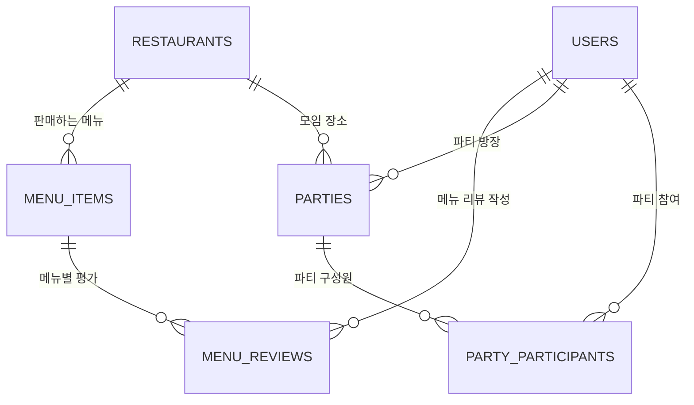

# 🍴 프로젝트 보고서: 우리 반 맛집 실록 (MySQL Edition)

본 프로젝트는 기존의 단편적인 맛집 등록 시스템을 넘어, **관계형 데이터베이스(RDBMS)**를 활용한 데이터 무결성 확보와 **메뉴 중심의 사용자 경험**을 제공하기 위해 설계된 Streamlit 기반 웹 애플리케이션이다.

## 1. 프로젝트 개요

* **목적**: 학급/팀원 간의 신뢰도 높은 맛집 데이터 공유 및 메뉴별 상세 리뷰 아카이빙.
* **주요 변경 사항**:
* 데이터 저장소 전환 (Google Sheets → MySQL).
* 리뷰 단위 고도화 (식당 중심 → 메뉴 아이템 중심).
* 사용자 인증 시스템 도입 (회원가입 및 로그인).

---

## 2. 시스템 아키텍처

본 시스템은 파이썬 라이브러리와 관계형 데이터베이스의 유기적인 결합을 통해 데이터의 생성, 조회, 시각화를 처리한다.

* **Frontend**: Streamlit을 활용한 반응형 웹 인터페이스 구현.
* **Backend Logic**: `data_handler.py`를 통한 CRUD 연산 및 비즈니스 로직 분리.
* **Database**: MySQL을 활용하여 1:N:M 관계의 정규화된 데이터 모델링 수행.
* **GIS**: `geopy`를 통한 주소 기반 위경도 추출 및 `folium` 기반 지도 시각화.

---

## 3. 데이터베이스 설계 (ERD)

데이터의 일관성을 위해 6개의 테이블이 상호 외래키(Foreign Key)로 연결되어 있으며, 특히 `MENU_REVIEWS`를 중심으로 상세 평가 데이터를 관리한다.

---

## 4. 주요 기능 및 특징

### 4.1 메뉴 중심의 데이터 적재 (Atomic Transaction)

단순 식당 리뷰가 아닌, '특정 식당의 특정 메뉴'에 대한 평가를 기록한다. 사용자가 정보를 입력하면 시스템은 다음과 같은 단계를 거쳐 데이터를 원자적으로 처리한다:

1. **사용자 식별**: 로그인된 세션 정보를 바탕으로 사용자 고유 ID 확인.
2. **맛집 검증**: 주소와 이름을 기준으로 기존 식당 존재 여부를 확인하고, 없을 경우 신규 좌표를 생성하여 등록.
3. **메뉴 및 리뷰 생성**: 해당 식당에 종속된 메뉴 아이템과 평점/코멘트를 연결하여 저장.

### 4.2 통합 식당 카드 UI

동일한 식당에 대한 중복 노출을 방지하기 위해 데이터를 그룹화하여 하나의 카드로 렌더링한다:

* **총점 산출**: 해당 식당에 등록된 모든 메뉴 리뷰의 평균값을 실시간으로 계산하여 상단에 노출.
* **최신순 피드**: 식당 카드 내의 리뷰 섹션은 시간 역순(Descending)으로 정렬되어 최신 경험을 우선적으로 표시.

### 4.3 데이터 시각화 및 분석

* **공간 분석**: 등록된 맛집들의 위치를 지도상에 마커로 표시하고 카테고리별 필터링 기능 제공.
* **트렌드 분석**: Plotly를 활용하여 일자별/맛집별 평점 추이를 선그래프로 시각화하여 인기 맛집의 흐름을 파악 가능.

---

## 5. 기술적 성과

* **보안성 강화**: `secrets.toml`을 활용하여 DB 접속 정보를 소스 코드와 분리하고 배포 시 보안 유출 방지.
* **성능 최적화**: SQL JOIN을 활용하여 여러 테이블에 흩어진 데이터를 단일 쿼리로 조회함으로써 네트워크 부하 감소.
* **사용자 편의성**: 자동 위경도 변환 로직을 통해 사용자가 좌표를 몰라도 주소만으로 지도를 생성 가능하게 함.

---

## 6. 설치 및 실행 방법

1. **패키지 설치**: `pip install -r requirements.txt`
2. **DB 설정**: `.streamlit/secrets.toml` 파일에 MySQL 접속 정보 입력
3. **실행**: `streamlit run main.py`
