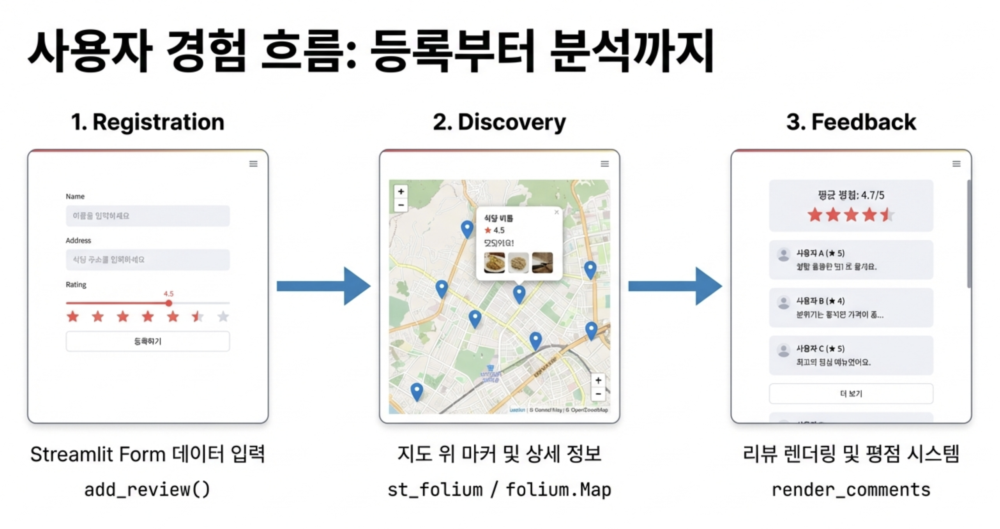
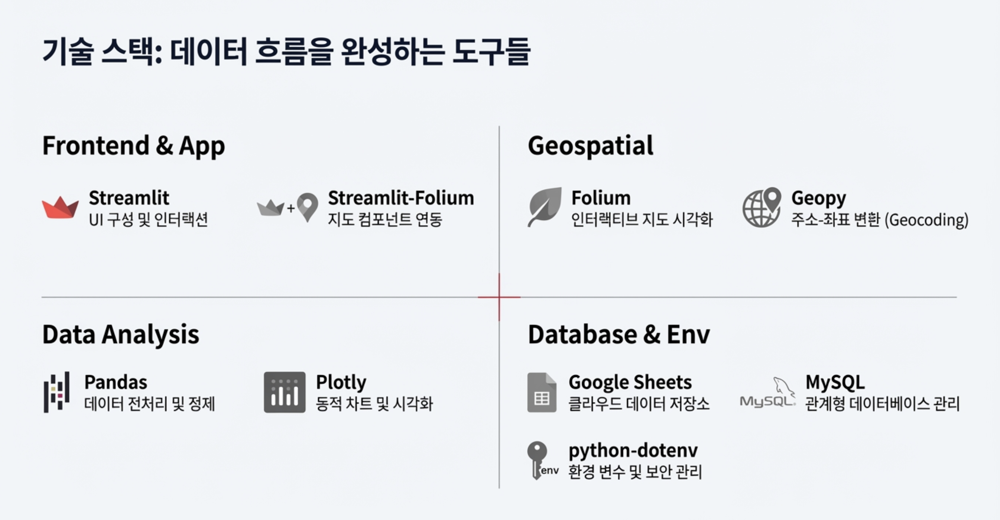
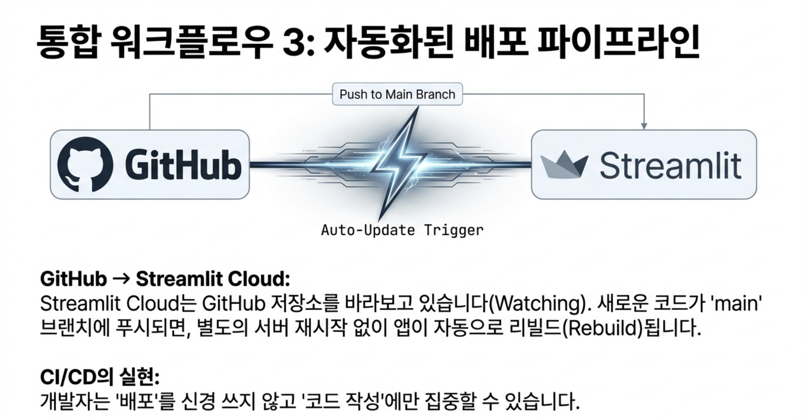
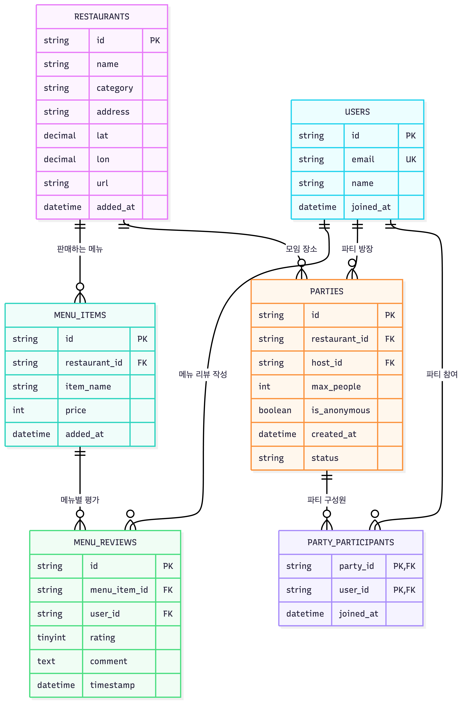

<<<<<<< HEAD
# 🍴 우리 반 맛집 실록 (MySQL Edition)

<div align="center">
  
</div>

> 부트캠프 동료들과 함께하는 맛집 공유 플랫폼

본 프로젝트는 부트캠프 동료들 간의 맛집 정보와 리뷰를 공유할 수 있는 플랫폼으로, 기존의 단편적인 맛집 등록 시스템을 넘어 **관계형 데이터베이스(RDBMS)**를 활용한 데이터 무결성 확보와 **메뉴 중심의 사용자 경험**을 제공하기 위해 설계된 Streamlit 기반 웹 애플리케이션입니다.

---

## 📋 목차

- [프로젝트 개요](#-프로젝트-개요)
- [주요 기능](#-주요-기능)
- [기술 스택](#-기술-스택)
- [시스템 아키텍처](#-시스템-아키텍처)
- [데이터베이스 설계](#-데이터베이스-설계)
- [설치 및 실행](#-설치-및-실행)
- [팀원 소개](#-팀원-소개)
- [트러블슈팅](#-트러블슈팅)

---

## 🎯 프로젝트 개요

### 프로젝트 목표

- 부트캠프 동료들 간에 **맛집 정보와 리뷰를 공유**할 수 있는 플랫폼 구축
- **맛집 미슐랭 가이드**로서 동료들이 서로 가본 맛집의 위치와 리뷰를 등록하여 경험을 공유
- 학급/팀원 간의 신뢰도 높은 맛집 데이터 공유 및 메뉴별 상세 리뷰 아카이빙

### 기획 배경

<div align="center">
  
</div>

- **맛집 추천과 후기**는 매우 유익하지만, 다양한 장소에 흩어져 있는 정보들을 **체계적으로 모은다면** 더 큰 가치를 제공할 수 있음
- **서로의 경험을 실시간으로 공유**하고, 이를 **지도로 확인**할 수 있는 서비스 제공
- 부트캠프에서 배운 **데이터 처리 및 시각화 기술**을 실제로 활용하는 좋은 기회

### 주요 변경 사항

- ✅ 데이터 저장소 전환 (Google Sheets → MySQL)
- ✅ 리뷰 단위 고도화 (식당 중심 → 메뉴 아이템 중심)
- ✅ 사용자 인증 시스템 도입 (회원가입 및 로그인)

---

## ✨ 주요 기능

<div align="center">
  
</div>

### 1. 로그인 및 회원가입
- 사용자 ID와 비밀번호를 이용한 로그인 시스템
- 세션 기반 사용자 인증 및 개인화 서비스

### 2. 메뉴 중심 맛집 등록
- 특정 식당의 특정 메뉴에 대한 상세 평가 기록
- 자동 주소 → 위경도 변환 (Geopy)
- 맛집 이름, 주소, 카테고리, 메뉴명, 별점, 후기, URL 등 입력

### 3. 통합 식당 카드 UI
- 동일 식당의 모든 리뷰를 하나의 카드로 그룹화
- 실시간 평균 별점 계산 및 표시
- 최신순 리뷰 정렬

### 4. 팀원 모집 기능
- 맛집 방문 팀원 모집 게시판
- 다른 사용자와 함께 맛집 방문 가능
- 실시간 팀원 목록 관리

### 5. 데이터 시각화
- **지도 시각화**: Folium 기반 맛집 위치 마커 표시
- **카테고리별 필터링**: 원하는 카테고리의 맛집만 선택적으로 확인
- **트렌드 분석**: Plotly를 활용한 일자별/맛집별 평점 추이 그래프
- **통계 차트**: 카테고리별 평균 별점 시각화

---

## 🛠 기술 스택

<div align="center">
  
</div>

### Frontend


### Backend


### Database


### Visualization


### Libraries
=======
# 데이터 활용 DB 적재, 분석 및 시각화 진행 (데이터를 입력받고, 우리의 DB에 적재하고 해당 데이터에 적합한 방식으로 시각화한다)

## 프로젝트 개요

이 프로젝트는 **Streamlit**을 이용하여 데이터를 입력받고 이를 **DB**에 적재한 후, 적합한 방식으로 시각화하여 최종 사용자에게 제공합니다. 주어진 데이터셋을 사용하여 웹 애플리케이션을 구현하고, 분석된 데이터를 시각화하여 인사이트를 제공합니다.

### **프로젝트 진행 배경**

- **프로젝트 목표**:
  - 부트캠프 동료들 간에 **맛집 정보와 리뷰를 공유**할 수 있는 플랫폼을 구축
  - **맛집 미슐랭 가이드**는 **부트캠프 동료들이 서로 가본 맛집의 위치와 리뷰를 등록**하여 **서로의 경험을 공유**할 수 있는 공간을 제공

- **기획 배경**:
  - **맛집 추천과 후기**는 매우 유익하지만, 다양한 장소에 흩어져 있는 정보들을 **체계적으로 모은다면** 더 큰 가치를 제공할 수 있음
  - **서로의 경험을 실시간으로 공유**하고, 이를 **지도로 확인**할 수 있는 서비스 제공

- **서비스 기능**:
  - **맛집 찾기**: 지도에서 맛집을 손쉽게 찾을 수 있음
  - **카테고리별 추천**: 카테고리별로 추천된 맛집들을 한눈에 확인
  - **실시간 업데이트**: 사용자들이 제공하는 데이터는 실시간으로 업데이트됨
  - **위치 확인**: 지도 상에서 맛집의 정확한 위치를 확인 가능
  - **인기 맛집 파악**: 카테고리별로 인기 있는 맛집들을 확인

- **기술적 기여**:
  - 부트캠프에서 배운 **데이터 처리 및 시각화 기술**을 실제로 활용하는 좋은 기회

---

## 기술 스택

>>>>>>> 89eb2a15cac9cdce76562111f7f71190b3a866c1
- **Streamlit**: 웹 애플리케이션의 인터페이스 구성
- **Pandas**: 데이터 분석 및 가공
- **MySQL**: 데이터 저장 및 관리
- **Folium**: 지리적 데이터 시각화
- **Plotly**: 인터랙티브 차트 시각화
- **Geopy**: 주소를 위도, 경도로 변환

---

<<<<<<< HEAD
## 🏗 시스템 아키텍처

<div align="center">
  
</div>

본 시스템은 파이썬 라이브러리와 관계형 데이터베이스의 유기적인 결합을 통해 데이터의 생성, 조회, 시각화를 처리합니다.

```
┌─────────────────────────────────────────┐
│     프레젠테이션 계층 (Frontend)          │
│           Streamlit UI                   │
└─────────────┬───────────────────────────┘
              │
┌─────────────▼───────────────────────────┐
│  애플리케이션 로직 계층 (Backend Logic)   │
│       data_handler.py                    │
│    CRUD 연산 + 비즈니스 로직             │
└─────────────┬───────────────────────────┘
              │
┌─────────────▼───────────────────────────┐
│       데이터 계층 (Database)             │
│     MySQL (정규화된 테이블 구조)         │
└─────────────────────────────────────────┘
              │
┌─────────────▼───────────────────────────┐
│         GIS (지리정보 시스템)            │
│    Geopy (주소→위경도) + Folium (지도)   │
└─────────────────────────────────────────┘
```

### 계층별 역할

<div align="center">
  
</div>

- **프레젠테이션 계층**: 웹 페이지 상의 데이터 입력, 시각화된 지도 및 차트 표시
- **애플리케이션 로직 계층**: 데이터 처리, 데이터베이스 연동, 분석 및 시각화 작업 수행
- **데이터 계층**: 1:N:M 관계의 정규화된 데이터 모델링, 데이터 안전 저장 및 관리
- **GIS 계층**: 주소 기반 위경도 추출 및 지도 시각화

---

## 💾 데이터베이스 설계

데이터의 일관성을 위해 6개의 테이블이 상호 외래키(Foreign Key)로 연결되어 있으며, 특히 `MENU_REVIEWS`를 중심으로 상세 평가 데이터를 관리합니다.

### ERD (Entity Relationship Diagram)

<div align="center">
  
</div>

### 주요 테이블

| 테이블명 | 설명 | 주요 컬럼 |
|---------|------|----------|
| USERS | 사용자 정보 | user_id, username, password |
| RESTAURANTS | 맛집 정보 | restaurant_id, name, address, latitude, longitude, category |
| MENU_ITEMS | 메뉴 아이템 | menu_id, restaurant_id, menu_name |
| MENU_REVIEWS | 메뉴별 리뷰 | review_id, menu_id, user_id, rating, comment |
| PARTIES | 팀원 모집 정보 | party_id, restaurant_id, host_id |
| PARTY_PARTICIPANTS | 파티 참여자 | participant_id, party_id, user_id |

---

## 🚀 설치 및 실행

### 사전 요구사항

- Python 3.8 이상
- MySQL 8.0 이상

### 설치 단계

1. **저장소 클론**
```bash
git clone https://github.com/your-username/restaurant-guide.git
cd restaurant-guide
```

2. **가상환경 생성 및 활성화**
```bash
python -m venv venv
source venv/bin/activate  # Windows: venv\Scripts\activate
```

3. **패키지 설치**
```bash
pip install -r requirements.txt
```

4. **데이터베이스 설정**

`.streamlit/secrets.toml` 파일을 생성하고 다음 내용을 입력:

```toml
[mysql]
host = "your-mysql-host"
port = 3306
database = "your-database-name"
user = "your-username"
password = "your-password"
```

5. **애플리케이션 실행**
```bash
streamlit run main.py
```

6. **브라우저 접속**
```
http://localhost:8501
```

### requirements.txt

```text
streamlit>=1.28.0
pandas>=2.0.0
mysql-connector-python>=8.0.0
folium>=0.14.0
plotly>=5.14.0
geopy>=2.3.0
streamlit-folium>=0.13.0
```

---

## 👥 팀원 소개

| 이름 | 역할 | 주요 기여 |
|------|------|----------|
| 김동환 | 팀장 / Full-stack | 전체적인 아이디어 기초 프레임 개발 및 Streamlit 애플리케이션 구현 |
| 김유정 | Backend / Data | MySQL 데이터베이스 연동 및 데이터 분석, 가격 데이터 시각화 |
| 권민석 | Frontend / DevOps | 로그인 기능 개발, Folium을 이용한 지도 깜빡임 문제 해결 |
| 이주형 | Database / Data | 데이터베이스 구축 및 데이터 정제 |

---

## 🔧 트러블슈팅

### 문제 1: MySQL 데이터베이스 연결 오류

**증상**
```
MySQL Connection Error: Access denied for user
```

**원인**: 데이터베이스 자격 증명 정보 오류

**해결방법**: 
- `.env` 파일 및 `secrets.toml` 파일의 데이터베이스 자격 증명 확인 및 수정
- MySQL 사용자 권한 확인: `GRANT ALL PRIVILEGES ON database_name.* TO 'username'@'host';`

---

### 문제 2: 주소 데이터 오류로 인한 지도 표시 오류

**증상**
```
Geocoding Error: Address not found
```

**원인**: 부정확한 주소로 인한 위경도 변환 실패

**해결방법**: 
- **Geopy**의 `Nominatim` geocoder를 사용하여 주소 검증 로직 추가
- 주소 입력 시 상세 주소 가이드라인 제공
- 변환 실패 시 사용자에게 알림 및 재입력 유도

---

### 문제 3: Folium 지도 깜빡임 현상

**증상**: Streamlit 리렌더링 시 지도가 계속 깜빡이는 현상

**원인**: Streamlit의 리렌더링으로 인한 지도 재생성

**해결방법**: 
- `st.session_state`를 활용한 지도 상태 관리
- 지도 객체를 세션에 캐싱하여 불필요한 재생성 방지
```python
if 'map' not in st.session_state:
    st.session_state.map = create_map()
```

---

## 🎓 기술적 성과

### 보안성 강화
- `secrets.toml`을 활용하여 DB 접속 정보를 소스 코드와 분리
- 배포 시 보안 유출 방지를 위한 환경 변수 관리

### 성능 최적화
- SQL JOIN을 활용하여 여러 테이블에 흩어진 데이터를 단일 쿼리로 조회
- 네트워크 부하 감소 및 응답 속도 향상

### 사용자 편의성
- 자동 위경도 변환 로직을 통해 사용자가 좌표를 몰라도 주소만으로 지도 생성 가능
- 직관적인 UI/UX 설계로 진입 장벽 최소화

### 데이터 무결성
- 관계형 데이터베이스의 외래키 제약 조건을 통한 데이터 일관성 보장
- 트랜잭션 처리로 데이터 정합성 유지

---

## 📊 프로젝트 성과

### 주요 성과

- ✅ Google Sheets에서 MySQL로의 전환을 통한 데이터 관리 고도화
- ✅ 메뉴 중심의 리뷰 시스템으로 상세한 맛집 정보 제공
- ✅ 사용자 인증 시스템을 통한 개인화된 서비스 구현
- ✅ 팀원 모집 기능을 통한 커뮤니티 활성화
- ✅ 지도 및 차트를 활용한 직관적인 데이터 시각화

### 학습 효과

부트캠프에서 배운 데이터 처리 및 시각화 기술을 실제로 활용하여, 데이터를 수집, 분석, 시각화하고 사용자에게 가치를 제공하는 방법을 배울 수 있는 좋은 기회가 되었습니다.

---

## 📝 라이선스

This project is licensed under the MIT License.

---

## 📧 문의

프로젝트에 대한 문의사항이 있으시면 이슈를 등록해주세요.

